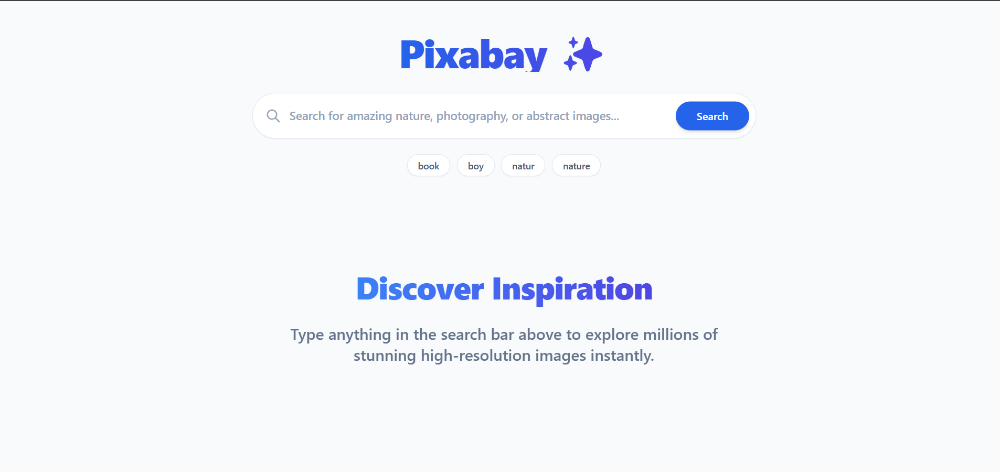
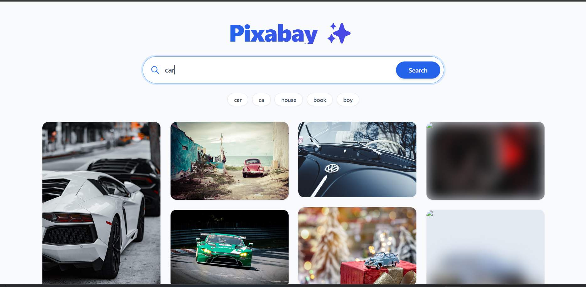
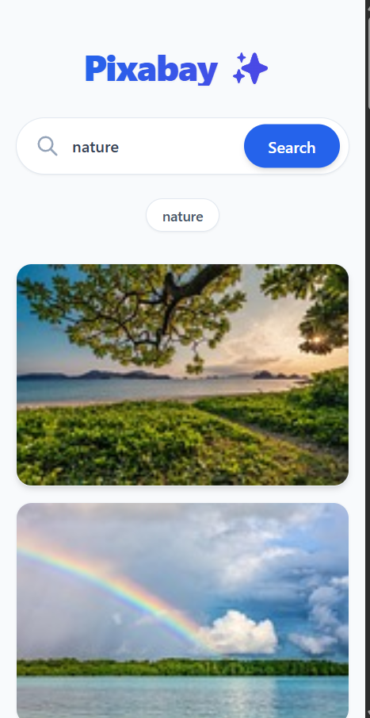
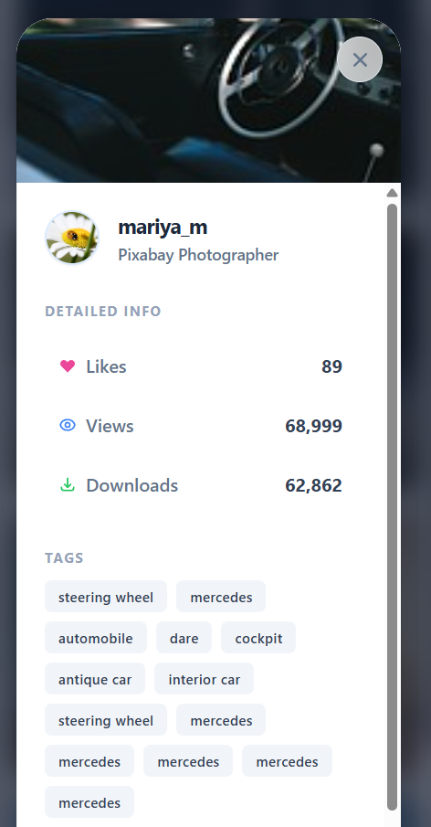

# PixaSearch 🔍✨

A beautiful, high-performance image search application powered by the [Pixabay API](https://pixabay.com/api/docs/). Built with React, Vite, and GSAP animations for a premium browsing experience.


## 📸 Screenshots

| Home Page | Search Results | Image Modal |
|-----------|----------------|-------------|
|  |  |  |

| Mobile View | Mobile Modal | Intro Animation |
|-------------|--------------|-----------------|
|  |  |  |
## ✨ Features

- **Instant Search** — Real-time image search with debounced input
- **Masonry Grid Layout** — Pinterest-style responsive image grid
- **Progressive Image Loading** — Blur-up technique with preview thumbnails
- **Fullscreen Modal** — High-resolution image viewer with download support
- **Smooth Animations** — GSAP-powered transitions and micro-interactions
- **Responsive Design** — Seamless experience across desktop, tablet, and mobile
- **Category Filters** — Quick-access trending category pills

## 🚀 Tech Stack

| Technology | Purpose |
|---|---|
| React 19 | UI Framework |
| Vite 8 | Build Tool & Dev Server |
| TailwindCSS 3.4 | Utility-first CSS |
| GSAP | Animations |
| React Query | Data Fetching & Caching |
| Axios | HTTP Client |
| Pixabay API | Image Data Source |

## 📦 Getting Started

### Prerequisites

- Node.js 18+
- A free [Pixabay API key](https://pixabay.com/api/docs/)

### Installation

```bash
# Clone the repository
git clone https://github.com/Omkarop0808/pixasearch.git
cd pixasearch

# Install dependencies
npm install

# Set up environment variables
cp .env.example .env
# Edit .env and add your Pixabay API key
```

### Development

```bash
npm run dev
```

Open [http://localhost:3000](http://localhost:3000) in your browser.

### Production Build

```bash
npm run build
npm run preview
```

## 🔧 Environment Variables

| Variable | Description |
|---|---|
| `VITE_PIXABAY_API_KEY` | Your Pixabay API key ([get one free](https://pixabay.com/api/docs/)) |

## 📁 Project Structure

```
pixasearch/
├── public/            # Static assets
├── src/
│   ├── components/    # React components (ImageCard, ImageModal, etc.)
│   ├── hooks/         # Custom React hooks
│   ├── services/      # API service layer
│   ├── utils/         # Utility functions
│   ├── App.jsx        # Main application component
│   └── main.jsx       # Entry point
├── index.html         # HTML template
├── vite.config.js     # Vite configuration
├── tailwind.config.js # Tailwind configuration
└── package.json
```

## 🌐 Deployment

This app is deployed on [Vercel](https://vercel.com). To deploy your own:

1. Fork this repository
2. Import the project on [Vercel](https://vercel.com/new)
3. Add `VITE_PIXABAY_API_KEY` as an environment variable
4. Deploy!

## 📄 License

This project is open source and available under the [MIT License](LICENSE).

---

Built with ❤️ by [Omkar](https://github.com/Omkarop0808)
